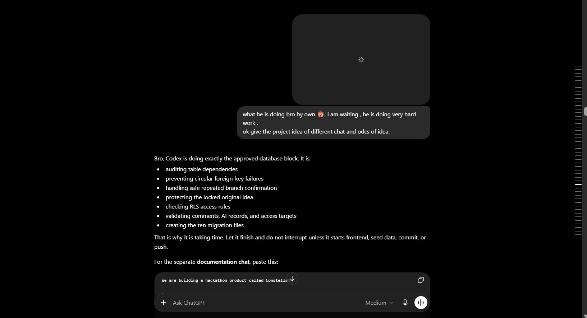
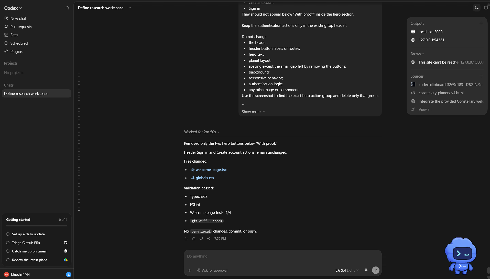

# Constellary

**Where ideas grow, get shaped, shared, and linked through collaboration with people and AI — with proof.**

Constellary is a provenance-first research workspace that preserves how research develops across branches, earlier work, collaborators, decisions, sources, and attributed AI contributions.

<!--  -->

## Explore Constellary

- [Live Application](https://constellary.vercel.app/)
- [Product Demo](https://www.youtube.com/watch?v=BZaiwaqXcGA)
- [Constellary as the Solution](https://www.youtube.com/watch?v=iomn6d2tFxM)
- [How Codex Eased the Work](https://www.youtube.com/watch?v=W-VDt359nxc)
- [Judge Testing Guide](docs/JUDGES_GUIDE.md)

## The Problem

Research tools usually preserve final papers, notes, citations, or documents.

They rarely preserve the complete journey behind the result:

- where an idea began;
- which earlier work influenced it;
- how it changed direction;
- who contributed;
- what was discussed or rejected;
- and where AI participated.

As research moves across files, chats, references, collaborators, and AI conversations, its origin and development become difficult to reconstruct.

Constellary turns that fragmented journey into a connected, visible, and reviewable research record.

## What Constellary Does

Constellary allows researchers to create branches, connect earlier research, develop work inside a shared Workspace, collaborate with others, and use GPT-5.6 with selected research context.

The system preserves:

- the origin of a research direction;
- direct branch ancestry;
- linked research and wider influence;
- subbranches created from changed directions;
- collaborator activity;
- comments and research history;
- human and AI contributions;
- and approved changes over time.

A branch is the core research object in Constellary.

A main branch and a subbranch use the same complete model. A subbranch is not a reduced note or secondary object. It can contain its own research content, Workspace activity, collaborators, links, comments, summaries, and future subbranches.

## How Codex Helped Build Constellary

Constellary was developed through continuous collaboration between the creator, GPT-5.6, and Codex.

The creator defined the research problem, provenance model, branch behaviour, collaboration rules, Workspace structure, interface direction, and human–AI attribution principles through detailed product reasoning with GPT-5.6.

Codex helped turn those decisions into a working system. It inspected the repository, implemented approved product flows, created and validated database migrations, connected frontend and backend behaviour, ran builds and tests, investigated browser and authentication errors, and corrected implementation issues through repeated review.

### Proof of the Build Process

Codex did not independently decide what Constellary should become.

It reduced the effort required to move from a detailed product design to a tested implementation while keeping major product, provenance, privacy, and AI decisions under human control.

[Watch how Codex eased the work](https://www.youtube.com/watch?v=W-VDt359nxc)

Read the complete development process in [Codex Collaboration](docs/CODEX_COLLABORATION.md).

## Core Product Flow

> Create a branch  
> → Define its origin and research direction  
> → Connect earlier or related work  
> → Confirm the branch  
> → Develop it inside Workspace  
> → Collaborate with people and GPT-5.6  
> → Review and approve contributions  
> → Preserve attribution and provenance  
> → Continue the direction or create a new subbranch

Before confirmation, the original idea and creation details remain editable.

After confirmation, the original idea, origin, title, ancestry, and protected initial provenance cannot be silently rewritten.

When the core research direction changes substantially, the new direction becomes a subbranch rather than replacing the confirmed meaning of the existing branch.

## Basic Architecture

Constellary uses a provenance-first architecture built around one shared branch model.

Researchers and collaborators interact through the Next.js application.

Server Actions and Route Handlers pass validated operations to the application service layer, which coordinates Supabase Auth, PostgreSQL, Storage, and the OpenAI Responses API.

Important provenance, collaboration, permission, and privacy rules are not enforced only through interface controls.

PostgreSQL constraints, transactional functions, triggers, and row-level security help protect confirmed branch identity, ancestry, ownership, attribution, and access.

Read the complete technical design in [Architecture](docs/ARCHITECTURE.md).

## Branches, Subbranches, and Linked Research

Constellary keeps direct ancestry separate from wider research influence.

### Parent Branch

A parent branch represents direct research ancestry.

It answers:

> Which confirmed research direction did this branch grow from?

### Linked Branch

A linked branch represents broader research context, such as:

- inspiration;
- evidence;
- comparison;
- related work;
- prior attempts;
- references;
- or continuation context.

A linked branch does not automatically become part of the direct ancestry chain.

### Subbranch

A subbranch represents a new research direction that grew from another branch.

It preserves the connection to the parent without rewriting the earlier branch.

## Workspace

The Workspace is where deeper research development happens.

Creation Workspace and Editing Workspace share the same basic structure:

- **Left:** branch context, origin, ancestry, and selected research path;
- **Centre:** the currently selected editor or AI interaction;
- **Right:** branch items such as summaries, notes, links, and contributions.

The Branch Page remains primarily for understanding, navigating, sharing, and discussing research.

Deeper editing belongs inside Workspace.

## GPT-5.6 Inside Constellary

GPT-5.6 is used through the OpenAI Responses API as a contextual research companion.

Researchers choose which permitted branch material should be included in the AI context.

GPT-5.6 can then help:

- develop a research summary;
- compare connected branches;
- identify gaps;
- suggest possible directions;
- structure research material;
- or reason over approved branch context.

AI output is not applied automatically.

Generated material remains separate until a human reviews, edits, approves, and applies it.

Approved AI contributions remain visibly attributed as part of the provenance record.

AI cannot independently:

- confirm a branch;
- rewrite a locked original idea;
- change ancestry;
- bypass permissions;
- invite collaborators;
- transfer ownership;
- change privacy;
- or publish its own output automatically.

Read the complete AI design in [AI Usage](docs/AI_USAGE.md).

## Collaboration

Collaboration remains branch-specific.

Invited collaborators may receive permission to:

- view a shared branch;
- read and add comments;
- contribute to editable research content;
- and open Workspace for that branch.

Access to one branch does not automatically expose unrelated research.

Ownership, privacy, invitation management, deletion, and locked provenance remain owner-controlled.

Contributions remain connected to the people and branches involved.

## What Makes Constellary Different

Many research products help people discover literature, map papers, organise knowledge, analyse sources, or write research material.

Constellary focuses on a different layer:

> Preserving how new research grows.

It records not only the final output, but also:

- direct research ancestry;
- linked influence;
- changes in direction;
- previous attempts;
- collaboration;
- decisions;
- approved AI contributions;
- and visible proof of how the work developed.

Constellary is not intended to become a generic note-taking application, document-sharing platform, or automatic AI-writing tool.

Its central purpose is to help people and AI grow research together while preserving proof of how every contribution shaped the work.

## Technical Stack

- Next.js App Router
- TypeScript
- Supabase PostgreSQL
- Supabase Auth
- Supabase Storage
- OpenAI Responses API
- GPT-5.6
- Tailwind CSS
- Vercel

## Documentation

| Document | Purpose |
|---|---|
| [Product](docs/PRODUCT.md) | Complete product behaviour, branch model, Workspace, collaboration, Dashboard, and product rules |
| [Architecture](docs/ARCHITECTURE.md) | Application architecture, database rules, services, security, permissions, and provenance enforcement |
| [AI Usage](docs/AI_USAGE.md) | GPT-5.6 context selection, generation, review, approval, attribution, and human control |
| [Codex Collaboration](docs/CODEX_COLLABORATION.md) | How GPT-5.6 and Codex supported product reasoning, implementation, testing, and correction |
| [Design Decisions](docs/DESIGN_DECISIONS.md) | Major product decisions, boundaries, and rejected approaches |
| [Design Evolution](docs/DESIGN_EVOLUTION.md) | How the original research problem developed into Constellary |
| [Judge Testing Guide](docs/JUDGES_GUIDE.md) | Live access, testing flow, prepared demo account, and key behaviours to inspect |

## Judge Access

The live application contains prepared research branches for evaluation.

Please use the account details provided in the private Devpost judging instructions.

For the complete testing sequence, see the [Judge Testing Guide](docs/JUDGES_GUIDE.md).

## License

Copyright © 2026 Khushboo Rani. All rights reserved.

Constellary is available for authorised OpenAI Build Week evaluation and testing under the terms described in the [LICENSE](LICENSE) file.

Nothing in that licence limits rights granted under the OpenAI Build Week Official Rules.